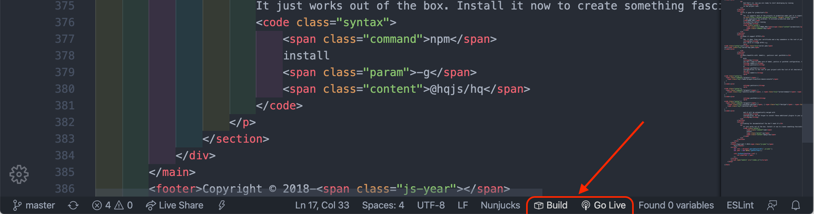
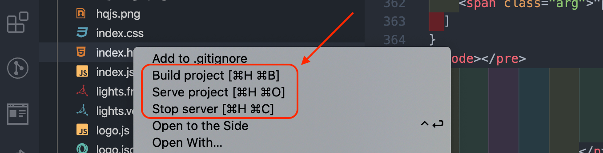

# HQ Live Server

💫 **One tool to rule them all**

[](https://marketplace.visualstudio.com/items?itemName=hqjs.hq-live-server) [](https://marketplace.visualstudio.com/items?itemName=hqjs.hq-live-server) [](https://marketplace.visualstudio.com/items?itemName=hqjs.hq-live-server) [](https://github.com/hqjs/vscode-hq-live-server/)
<br>

**Launch a local development server with live reload feature for static & dynamic pages.**
<br>


## Features
* A Quick [Development Live Server](https://hqjs.org) with live browser reload.
* Quick start with any framework: `Polymer`, `Svelte`, `Vue`, `React`, `Angular` or plain js.
* Supports metalanguages: `typescript`, `coffeescript`, `sass`, `scss`, `less` and `pug`.
* No configuration is required.
* Production build with a single click.
* Start or Stop server by just a click from status bar or touch bar.
* Hot Key control.
* `HTTP2/HTTPS` support.
* Customizable preferred Port Number and/or default browser.
* Support for any browser _(Eg: Firefox Nightly)_ using advance Command Line.
* Support for Chrome Debugging Attachment (_[More Info](https://marketplace.visualstudio.com/items?itemName=msjsdiag.debugger-for-chrome)_).
* Remote Connect through WLAN (E.g.: Connect with mobile)
* Multi-root workspace supported.

## Shortcuts to Build and Start/Stop Server

1. Open a project and click to `Go Live` from the status bar to turn the server on/off. Click `Build` button to make a production build.


2. Right click on a project file from Explorer Window and click on `Serve project`.
.

3. Open a project file and right-click on the editor and  click on `Serve project`.


4. Open a project and build it or start/stop server from a touchbar.


5. Hit `(alt+H, alt+O)` to Open the Server, `(alt+H, alt+C)` to Stop the server and `(alt+H, alt+B)` to Build the Project (You can change the shortcut form keybinding). *[On MAC, `cmd+H, cmd+O`, `cmd+H, cmd+C` and `cmd+H, cmd+B`]*

6. Open the Command Pallete by pressing `F1` or `ctrl+shift+P` and type `HQ Live Server: Serve project ` to start a server, type `HQ Live Server: Stop Server` to stop a server or `HQ Live Server: Build project` to make a production build.

## Installation
Open VSCode and type `ctrl+P`, type `ext install hqjs.hq-live-server`.

Note that you should have `nodejs >= 12.10.0` installed as default in your system. You can do it with [nvm](https://github.com/nvm-sh/nvm)
```sh
nvm i 12
nvm alias default 12
```

## FAQs
* How to access the server from Mobile?

  After you pressed `Go Live` button server address will appear
  
  follow this address on your mobile device within your local network.

* Are Multi-root workspaces supported?

  Yes, you can run separate server instance for every project in your workspace.

* Do I need to configure webpack or babel to start development?
  
  No, you can press `Go Live` button and start development immediatly. Extension will take care of everything else.

* Can I create production build without any configuration?

  Yes, you can press `Build` button and production build will be created
  in a `dist` folder (please, note: all previous content of `dist` folder will be erased).

* How to run server in `HTTP2/HTTPS` mode?

  Create pair of certificate and a key in `.pem` format and put them somewhere inside your project. Server will automatically recognise them and start in HTTP2/HTTPS mode. For generating self signed certificates check this [tool](https://github.com/FiloSottile/mkcert).

## Settings
* **`hqServer.defaultPort`:** Preferred Port Number for your Live Server.
    *  _Default value is `8080`._

    <hr>

* **`hqServer.showOnStatusbar`:** Display `Go Live` button on the statusbar.
    *  _Default value is `true`._

    <hr>

* **`hqServer.browser.useBuiltinBrowser`:** Open in [Browser Preview](https://marketplace.visualstudio.com/items?itemName=auchenberg.vscode-browser-preview) extension inside VS Code, instead of default browser.
    
    *  _Default value is `false`.

    <hr>

* **`hqServer.browser.preferredBrowser`:** To change your system's default browser.
    * _Default value is `""`. (It will open your system's default browser.)_
    * *Available Options :*
        * chrome
        * chrome:PrivateMode
        * firefox
        * firefox:PrivateMode
        * safari
        * microsoft-edge
        * blisk

    _Not enough? need more? open an/a issue/pull request on github. For now, use `hqServer.browser.browserCmdLine` settings (see below)._
    
    <hr>

* **`hqServer.browser.browserCmdLine`:**  To set your any favorite browser (Eg: Chrome Canary, Firefox Nightly) using advance Command Line. _(You can specify full path of your favorite custom browser)_.

    * _This setting will override `Preferred Browser` and `Attach Chrome Debugger` settings._
    * _Default Value is `""`_ 
    * _Examples:_
        * _chrome --incognito --headless --remote-debugging-port=9222_
        * _C:\\Program Files\\Firefox Developer Edition\\firefox.exe --private-window_
    
    <hr>

* **`hqServer.browser.attachChromeDebugger`:** To Enable Chrome Debugging Attachment to Live Server.
    * _**NOTE**: You must have to install [ `Debugger for Chrome.`](https://marketplace.visualstudio.com/items?itemName=msjsdiag.debugger-for-chrome)_
    
    * _If the value is `true`, Start Live Server and select 'Attach to Chrome' from Debug Window to start debugging. [`Debugger for Chrome`](https://marketplace.visualstudio.com/items?itemName=msjsdiag.debugger-for-chrome) Extension will inject debugging feature into running instance of browser window._
   
    *  _Default value is `false`._

    <hr>


## LICENSE
This extension is licensed under the [MIT License](LICENSE)
